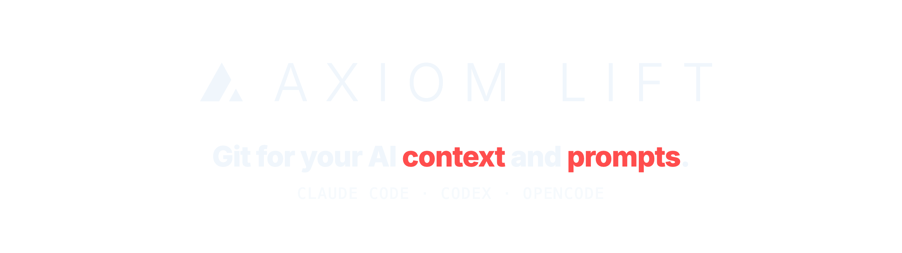
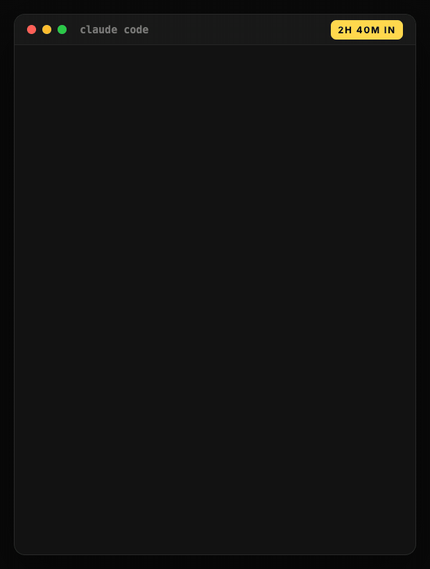
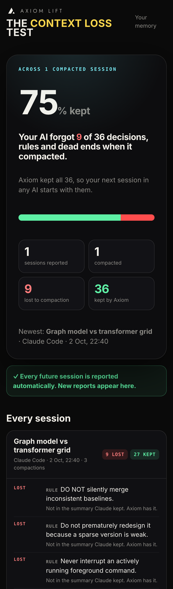
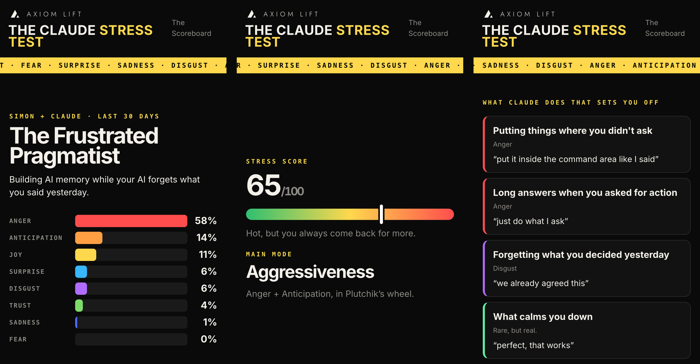
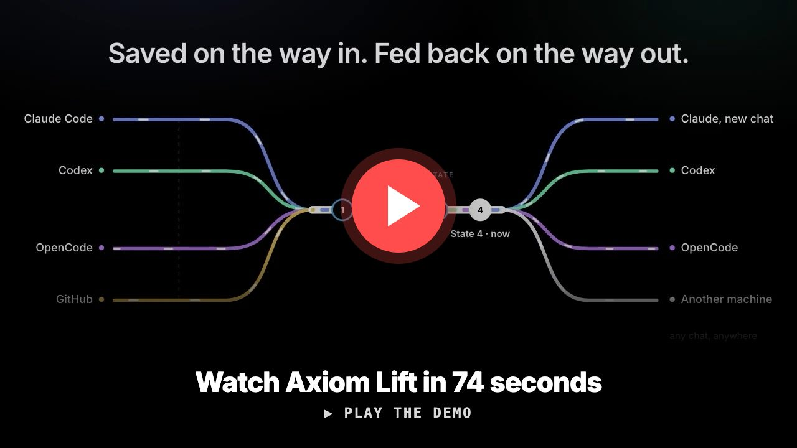
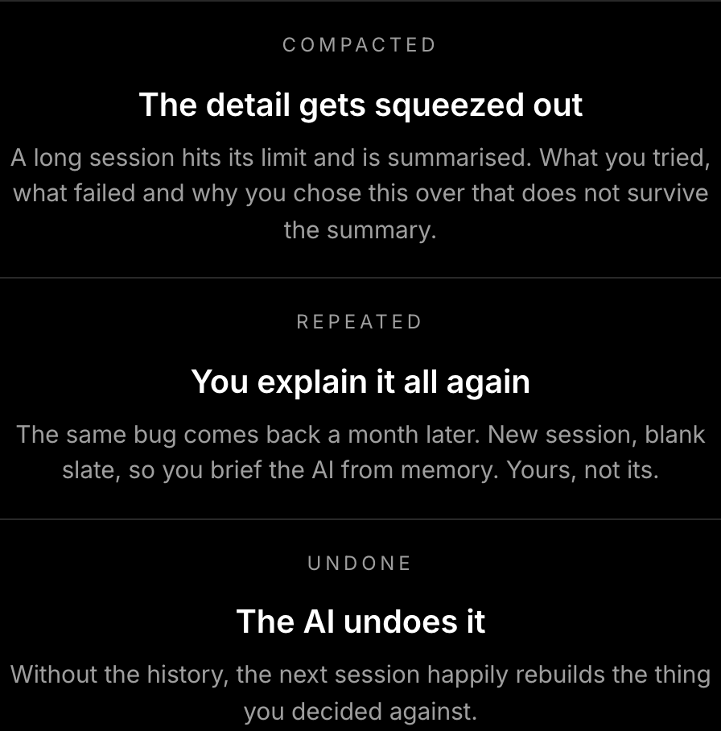
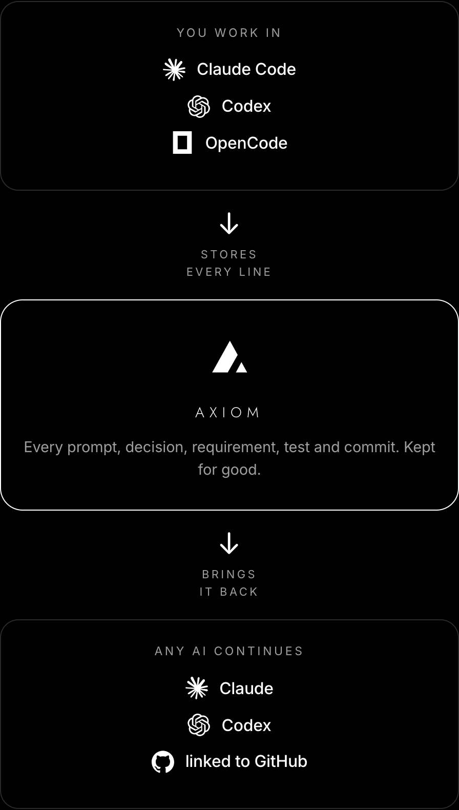
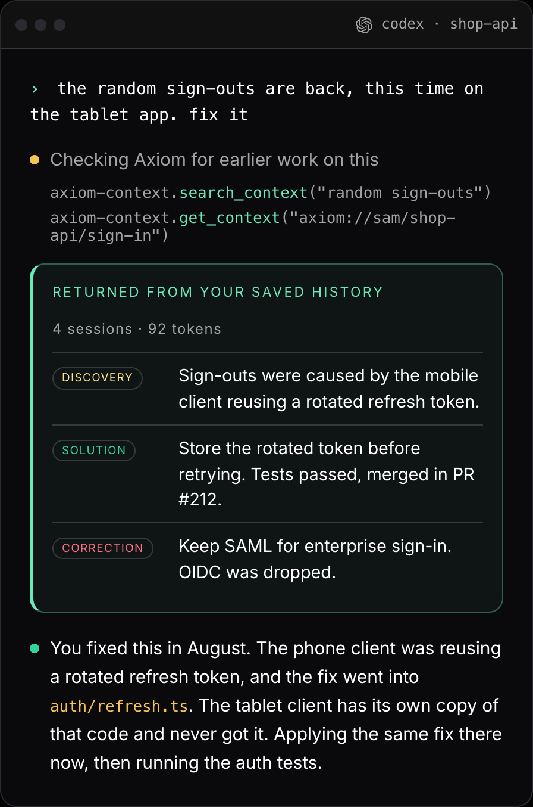
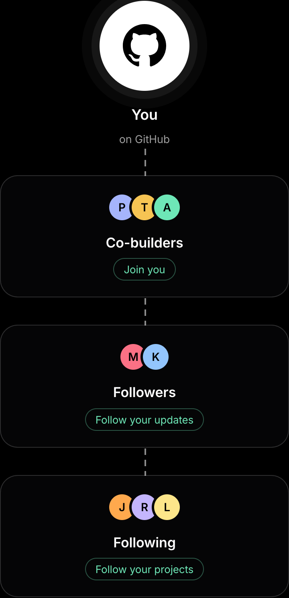

<p align="center">
  <a href="https://www.axiomlift.ai/?utm_source=github&utm_medium=readme">
    <picture>
      <source media="(prefers-color-scheme: dark)" srcset="assets/header-dark.png">
      <source media="(prefers-color-scheme: light)" srcset="assets/header-light.png">
      
    </picture>
  </a>
</p>

<p align="center">
  <a href="https://www.axiomlift.ai/?utm_source=github&utm_medium=readme"></a>
  
  
  <a href="https://www.axiomlift.ai/free?utm_source=github&utm_medium=readme"></a>
</p>

<p align="center"><b>Claude Code just compacted. Your decisions didn't go with it.</b><br>
Axiom Lift keeps every decision, rule and fix from your AI coding sessions and hands it back to the next one:<br>
after <code>/compact</code>, in another tool, on another laptop.</p>

<p align="center">
  
</p>

<p align="center">
  <a href="#the-context-loss-test"><b>Test how much your AI forgets ↓</b></a> &nbsp;·&nbsp; <a href="#install"><b>Install in one command ↓</b></a>
</p>

---

## The Context Loss Test

**How much of your work does your AI remember after it compacts?** Find out on your own sessions.

```sh
curl -fsSL "https://www.axiomlift.ai/install.sh?test=amnesia" | sh
```

<table>
<tr>
<td width="300"></td>
<td>

1. **It asks to use your Claude Code.** Say yes and your own Claude reads your sessions, in the background on your
   computer: no tools, nothing saved, a little of your allowance. Nothing is sent to an AI of ours.
2. **Pick how many sessions to test.** Press Enter for the newest one, type a number, or `all`.
3. **Make your free account** right there in the terminal. Your history goes up as normal (copies of the same
   conversation are only read once).
4. **Your report opens in the browser.** For every compaction: the decisions, rules and dead ends from before it, and
   which ones the summary Claude kept still carries, quoting the summary. Rephrasing counts.
5. **Every future session is reported too,** when it ends or compacts. Your reports are private to you.

The founder's first report: **75% kept, 9 of 36 lost**, all three of the rules above among them.

How it's checked, and what it can't tell you: [METHODOLOGY.md](METHODOLOGY.md) · [axiomlift.ai/context-test](https://www.axiomlift.ai/context-test?utm_source=github&utm_medium=readme)

</td>
</tr>
</table>

## The Claude Stress Test

**What does Claude bring out in you?** Your last 30 days of messages, on Plutchik's wheel of emotions: a stress score,
your main mode, and what Claude does that sets you off, in your own words. Written by your own Claude Code too; only
the profile and the lines it quotes reach your account.

```sh
curl -fsSL "https://www.axiomlift.ai/install.sh?test=stress" | sh
```

<p align="center"></p>

<p align="center"><sub>Example report. Challenge a friend and see where you rank on <a href="https://www.axiomlift.ai/scoreboard?utm_source=github&utm_medium=readme">the Scoreboard</a>.</sub></p>

---

## Watch it

<p align="center">
  <a href="https://www.axiomlift.ai/static/video/axiom-lift-intro.mp4">
    
  </a>
</p>

## Your project's context is all over the place

Every decision you make with an AI lives somewhere different: in a Claude Code session that's about to compact, in a
Codex chat you opened when you hit a rate limit, in OpenCode, in your teammate's AI, in a `CLAUDE.md` you wrote once
and never updated. None of it is anywhere your next session can see.

<p align="center"></p>

## Axiom Lift centralises it

**One memory for your project, that every AI reads from.** Axiom Lift sits beside your tools, saves what they decide
as they work, and hands back the few lines the next session needs: in any tool, on any machine.

<p align="center"></p>

- **Saved on the way in.** Decisions, rules and fixes are filed as you work. Nothing to write by hand.
- **Fed back on the way out.** After `/compact`, in a new session or a different tool, your AI starts knowing what you
  already decided, and where it was decided.
- **Across tools.** Start in Claude Code, carry on in Codex or OpenCode.
- **Across your team, when you choose.** Share a decision or a project's state so nobody works it out twice.

## What it looks like

A normal Codex chat. Nobody re-explained anything: the history came back from Axiom Lift. **Ninety tokens, not ninety
thousand.**

<p align="center"></p>

## Build with the people you already build with

Share a decision, a project's state or a solved problem with the people you build with, in one step. Nothing is sent
until you press it.

<p align="center"></p>

## Install

**macOS / Linux** (needs Python 3):

```sh
curl -fsSL https://www.axiomlift.ai/install.sh | sh
```

**Windows** (PowerShell):

```powershell
irm https://www.axiomlift.ai/install.ps1 | iex
```

It asks you to sign up or sign in right there in the terminal, then connects the AI tools it finds on this computer.
**The first 5 GB are free:** [axiomlift.ai/free](https://www.axiomlift.ai/free?utm_source=github&utm_medium=readme).
On Windows the tests are `irm "https://www.axiomlift.ai/install.ps1?test=amnesia" | iex` (or `?test=stress`).
The scripts are short and readable: [`install.sh`](install.sh) · [`install.ps1`](install.ps1) (copies of what the
commands above download).

| | |
|---|---|
| Leave a project out | `python3 ~/.axiom-context/src/axiom.py exclude /path/to/project` |
| Uninstall | `python3 ~/.axiom-context/src/axiom.py uninstall` |

## Privacy

- Your sessions are kept in **your Axiom Lift account**, private to you. Nothing is shared with anyone unless you share it.
- API keys and passwords are **cut out** before anything is stored.
- Leave any project out, download a copy of your data, and **delete your account and everything in it** at any time.
- Your data is not sold, not used for advertising, and not used to train any model.

Full details: [axiomlift.ai/privacy](https://www.axiomlift.ai/privacy).

## FAQ

<details><summary><b>How is this different from <code>CLAUDE.md</code>?</b></summary><br>
<code>CLAUDE.md</code> is a file you write and keep up to date by hand, for one tool. Axiom Lift captures decisions as
you work, across Claude Code, Codex and OpenCode, and across your team's machines.
</details>

<details><summary><b>Do I have to change how I work?</b></summary><br>
No. Keep using Claude Code, Codex or OpenCode as normal; Axiom Lift works alongside your sessions.
</details>

<details><summary><b>Which tools and systems does it work with?</b></summary><br>
Claude Code, Codex (CLI) and OpenCode, on macOS, Linux and Windows.
</details>

<details><summary><b>Is it free?</b></summary><br>
Yes: your first 5 GB of AI memory are free. See <a href="https://www.axiomlift.ai/free?utm_source=github&utm_medium=readme">axiomlift.ai/free</a>.
</details>

<details><summary><b>Do the tests cost me anything?</b></summary><br>
They use your own Claude Code in the background, so a little of your Claude allowance: about a minute of its time for a
few sessions. If you're at your limit it waits and tries again later. Without Claude Code the Stress Test is written by
Axiom instead, free.
</details>

<details><summary><b>Where do I report a bug or ask for a feature?</b></summary><br>
<a href="../../issues/new/choose">Open an issue</a>. We read every one.
</details>

---

<p align="center">
  <a href="https://www.axiomlift.ai/?utm_source=github&utm_medium=readme"><b>axiomlift.ai</b></a> ·
  <a href="mailto:hello@axiomlift.ai">hello@axiomlift.ai</a> ·
  <a href="https://x.com/SiWeatherall">@SiWeatherall</a>
</p>
